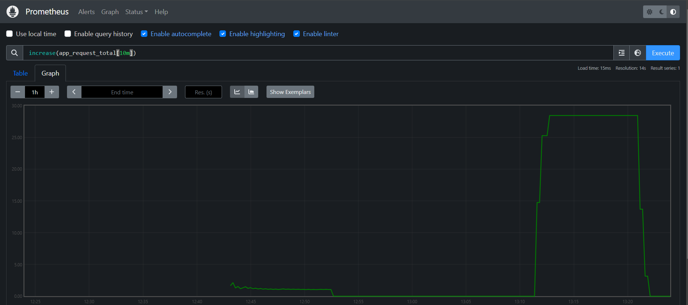
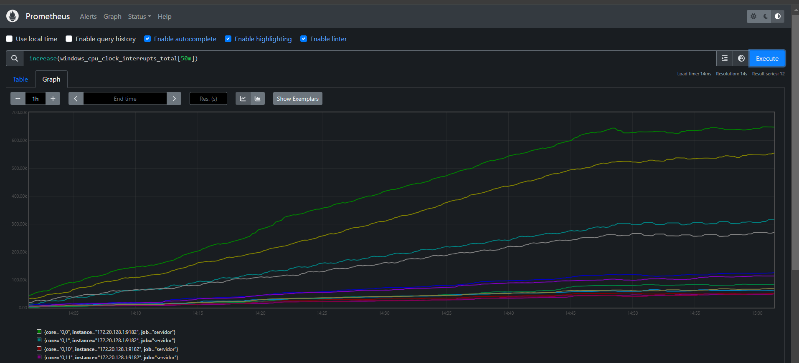
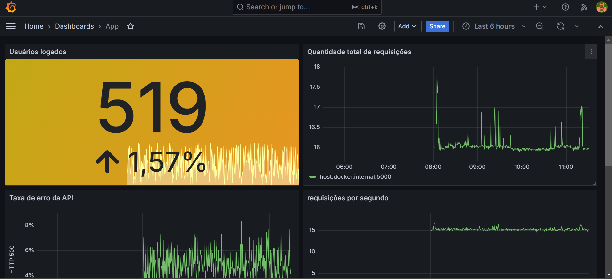

# Prometheus
Podemos rodar o Prometheus diretamente na máquina ou, ainda, dentro de um container.
Para a segunda opção, ele irá gerar um arquivo de configuração padrão para monitorar apenas ele mesmo. 
Podemos adaptar essa configuração montando um volume para esse container com um arquivo de configuração adaptado e apontado para o /etc/prometheus/prometheus.yml.

```
docker run --name prometheus --rm -d -p 9090:9090 -v "/home/victor/Documents/projetos/prometheus/prometheus.yaml:/etc/prometheus/prometheus.yml" prom/prometheus
```

## Monitorando aplicação
Vamos usar de exemplo uma simples aplicação node.
Vamos usar duas bibliotecas, o express e o prom-client.
```
npm install --save express
npm install --save prom-client
```
Dessa forma conseguimos enviar as métricas para o Prometheus.
Vamos utilizar as mais comuns, que são os contadores, o sumário e o histograma.
Pelo lado da aplicação, podemos adicionar essas métricas conforme a necessidade da informação que desejamos monitorar. Vamos aplicar por exemplo, quantidade de requisições.

### Aplicação Node
```
var express = require ('express');
var prom = require('prom-client');
var register = prom.register;
var app = express();
```

```
const counter = new prom.Counter({
    name: 'app_request_total',
    help: 'Contador de requests',
    labelNames: ['statusCode'],
});
```

```
app.get('/', function(req, res) {
	counter.labels('200').inc();
    res.send('Hello World!');
});
```

```
app.get('/metrics', async function(req, res) {
    res.set('Content-Type', register.contentType);
    res.end(await register.metrics());
});
```

Setando essas métricas para o /metrics, nós agora podemos configurar o Prometheus para pegar os logs desse endereço.

### Configurando Prometheus
Dentro do arquivo de configuração do Prometheus, precisamos criar um novo Job para a aplicação e passar qual é o endereço target. Como está rodando localmente, irei passar o meu IP como target.
```
- job_name: application
  honor_timestamps: true
  track_timestamps_staleness: false
  scrape_protocols:
  - OpenMetricsText1.0.0
  - OpenMetricsText0.0.1
  - PrometheusText0.0.4
  metrics_path: /metrics
  scheme: http
  enable_compression: true
  follow_redirects: true
  enable_http2: true
  static_configs:
  - targets:
    - 172.20.128.1:5000
```
## Prometheus
Dessa forma, já podemos consultar as métricas pelo Prometheus.



## Exporter
O exporter ele atua como uma camada intermediária. Então vamos supor que queremos monitorar algo que não conseguimos mexer diretamente no código fonte, como por exemplo informações de infraestrutura. Nestes casos, podemos usar um exporter, que basicamente vai entregar os dados para o Prometheus no formato que ele entenda.

Para windows, podemos pegar diretamente do repositório do windows_exporter.
```
https://github.com/prometheus-community/windows_exporter
```
Uma vez instalado e rodando, basta acessar o ambiente local na porta 9182.
```
http://127.0.0.1:9182/metrics
```

Feito isso, basta configurar o Prometheus para pegar as informações do host:
```
- job_name: servidor
  honor_timestamps: true
  track_timestamps_staleness: false
  scrape_protocols:
  - OpenMetricsText1.0.0
  - OpenMetricsText0.0.1
  - PrometheusText0.0.4
  metrics_path: /metrics
  scheme: http
  enable_compression: true
  follow_redirects: true
  enable_http2: true
  static_configs:
  - targets:
    - 172.20.128.1:9182
```




## Grafana
A partir do momento que estamos enviando todas as métricas que desejamos monitorar e observar para o Prometheus, podemos utilizar o Grafana para fazer a plotagem e criação de Dashboards personalizados.
O Grafana além disso, permite também fazer a criação de alertas e facilita no monitoramento, uma vez que podemos utilizar a linguagem PromQL para criar esses gráficos.

## Dashboards
Para facilitar, vamos colocar tanto o Prometheus quanto o Grafana dentro do docker-compose. Então para subir esses serviços basta executar:
```
cd docker
docker-compose up -d
```

No caso eu criei alguns dashboards que poderiam ser úteis no dia a dia. Então estou monitorando a quantidade de usuários logados na minha aplicação no momento, quantidade total de requisições (por segundo), taxa de erro, duração das requisições e etc.


Caso queira importar esses dashboards para dentro do grafana, basta utilizar o arquivo arquivos/app.json
